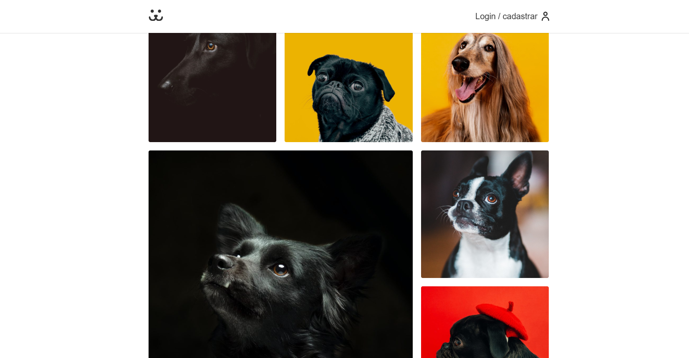
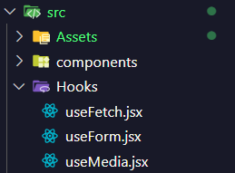
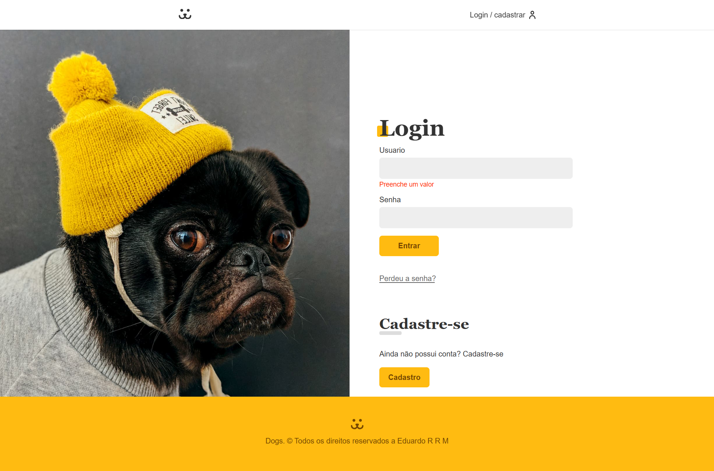

# Aplicação React e API de Postagem de foto🖥️

Deselvolvido no curso de React Completo e Api RestFull da Origamid Rede Social DOGS, para Postagems de fotos de cachorros.

ACESSE CERTIFICADO: https://www.origamid.com/certificate/f3f54520

Desenvolvido desde a API com wordpress até a o codigo react a aplicação ultiliza de recursos avançados do react como Context APIS, Hooks e tratamento de requisiçoes para APIS e possui as funcionalidades de Adicionar, remover exibir e autenticar, fotos, usuarios e comentarios.

## 📲 Acesse e Veja!

ACESSE: https://dogs-rede.vercel.app/

## Funcionalidades

- Custom hooks
  Criado para uso do projeto os hooks customizados useFetch e useForm para tratamento e reutilização de codigo para Fetch APIS e Formularios resprctivamente

Confira o codigo useFetch:

Ultilizado para reutilizar a logica de Fetch para todas as funcionalidades principais da aplicação. Confira no repositorio!

    const useFetch = () => {
    const [data, setData] = React.useState(null);
    const [erro, setErro] = React.useState(null);
    const [loading, setLoading] = React.useState(false);

    const request = React.useCallback(async (url, options) => {
        let response;
        let json;
        try {
        setErro(null);
        setLoading(true);
        response = await fetch(url, options);
        json = await response.json();
        if (!response.ok) throw new Error(json.message);
        } catch (err) {
        json = null;
        setErro(err.message);
        } finally {
        setData(json);
        setLoading(false);
        return { response, json };
        }
    }, []);

    return { data, loading, erro, request };
    };

Confira o codigo useForm:

    const validacao = {
    email: {
        regex: /^[^\s@]+@[^\s@]+\.[^\s@]+$/,
        mensagem: 'Preencha um email valido',
    },
    password: {
        regex: /^(?=.{8,})(?=.*[a-zA-Z])(?=.*\d)(?=.*[!#$%&? "]) $/,
        mensagem:
        'A senha precisa ter, 1 caracter maiusculo (A-Z), 1 caracter minusculo (a-z), 1 caracter especiarl ($,@,#...) e um caracter numerico (0-9), minimo de 8 caracteres',
    },
    numero: {
        regex: /^\d+$/,
        mensagem: 'Ultilize numeros apenas',
    },
    };

    const useForm = (type) => {
    const [value, setValue] = React.useState('');
    const [error, setError] = React.useState(null);

    function validate(value) {
        if (type === false) return true;
        if (value.length === 0) {
        setError('Preenche um valor');
        return false;
        } else if (validacao[type] && !validacao[type].regex.test(value)) {
        setError(validacao[type].mensagem);
        return false;
        } else {
        setError(null);
        return true;
        }
    }

    function onChange({ target }) {
        if (error) validate(target.value);
        setValue(target.value);
    }

    return {
        value,
        setValue,
        onChange,
        validate: () => validate(value),
        error,
        onBlur: () => validate(value),
    };
    };

- Authenticação e login de usuario
  Atravez da Api desenvolvida e personalizada em wordpress a aplicação é capaz de realizar login, logout e autenticação do usuario.

Ultilizado Context API para tratamento e autenticação de usuarios:

    export const UserContext = React.createContext();

    export const UserStorage = ({ children }) => {
    const [data, setData] = React.useState();
    const [login, setLogin] = React.useState();
    const [loading, setLoading] = React.useState();
    const [erro, setErro] = React.useState();
    const navigate = useNavigate();

    const userLogout = React.useCallback(async function () {
        setData(null);
        setErro(null);
        setLoading(false);
        setLogin(false);
        window.localStorage.removeItem('token');
    }, []);

    async function getUser(token) {
        const { url, options } = USER_GET(token);
        const response = await fetch(url, options);
        const json = await response.json();
        setData(json);
        setLogin(true);
    }

    async function userLogin(username, password) {
        try {
        setErro(null);
        setLoading(true);
        const { url, options } = TOKEN_POST({ username, password });
        const tokenRes = await fetch(url, options);
        if (!tokenRes.ok) throw new Error(`Error: ${tokenRes.statusText}`);
        const { token } = await tokenRes.json();
        window.localStorage.setItem('token', token);
        await getUser(token);
        navigate('/conta');
        } catch (err) {
        setErro(err.message);
        setLogin(false);
        } finally {
        setLoading(false);
        }
    }

    React.useEffect(() => {
        async function autoLogin() {
        const token = window.localStorage.getItem('token');
        if (token) {
            try {
            setErro(null);
            setLoading(true);
            const { url, options } = TOKEN_VALIDATE_POST(token);
            const response = await fetch(url, options);
            if (!response.ok) throw new Error('Token invalido');
            await getUser(token);
            } catch (err) {
            userLogout();
            } finally {
            setLoading(false);
            }
        } else {
            setLogin(false);
        }
        }
        autoLogin();
    }, [userLogout]);

    return (
        <UserContext.Provider
        value={{ userLogin, userLogout, data, erro, loading, login }}
        >
        {children}
        </UserContext.Provider>
    );
    };

- cadastramento, Exibição e Estilização avançada das fotos

usando useFetch, travez da API desenvolvida pode-se adicionar suas proprias fotos a rede social Ficticia Dogs.
Que então serão armazenadas no banco Wordpress, novamente carregadas pelo useFetch e exibidas com uma estilização avançada de galeria aleatoria.

Componente com Fetch e exibição aleatoria de galeria:

    const FeedPhotos = ({ user, page, setPhotoModal, setInfinite }) => {
    const { data, loading, erro, request } = useFetch();
    const [layout, setLayout] = React.useState(null);
    const media = useMedia('(max-width: 40rem)');

    React.useEffect(() => {
        async function fetchPhotos() {
        const total = 6;
        const { url, options } = PHOTOS_GET({ page, total, user });
        const { response, json } = await request(url, options);
        if (response && response.ok && json.length < total) setInfinite(false);
        }
        fetchPhotos();
    }, [request, user, page]);

    React.useEffect(() => {
        if (!media) {
        const numeroLayot = Math.floor(Math.random() * 5) + 1;
        setLayout(numeroLayot);
        } else {
        setLayout(null);
        }
    }, [media]);

    if (erro) return <Erro erro={erro} />;
    if (loading) return <Loading />;
    if (data)
        return (
        <ul className={`${estilos.feed} animeLeft`}>
            {data.map((photo) => (
            <li
                className={`${estilos.itemPhoto} ${
                layout !== null ? estilos[`m${layout}`] : ''
                }`}
                key={photo.id}
                onClick={() => setPhotoModal(photo)}
            >
                <FeedPhotosItem photo={photo} />
            </li>
            ))}
        </ul>
        );
    else return null;
    };

## Autores

- [@EduardoRRMalaquias](https://github.com/EduardoRRMalaquias)
